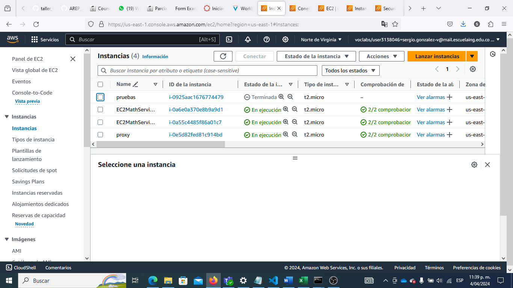
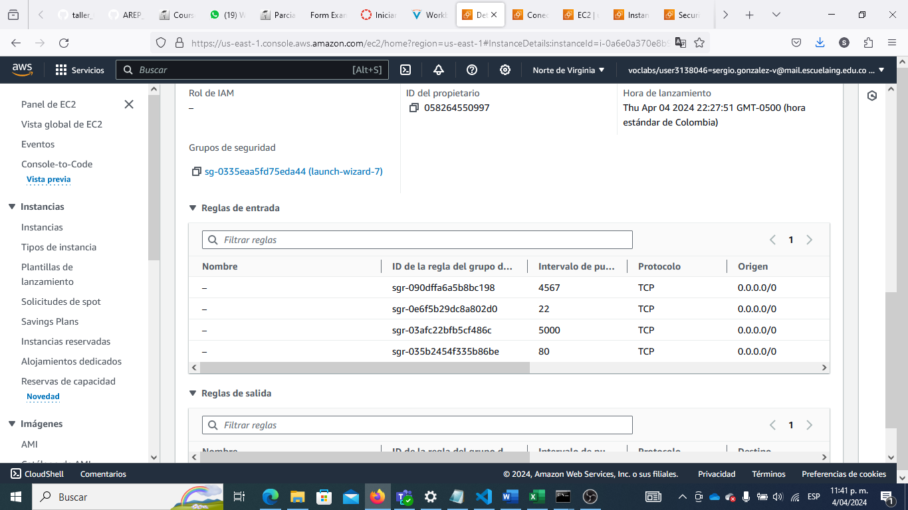
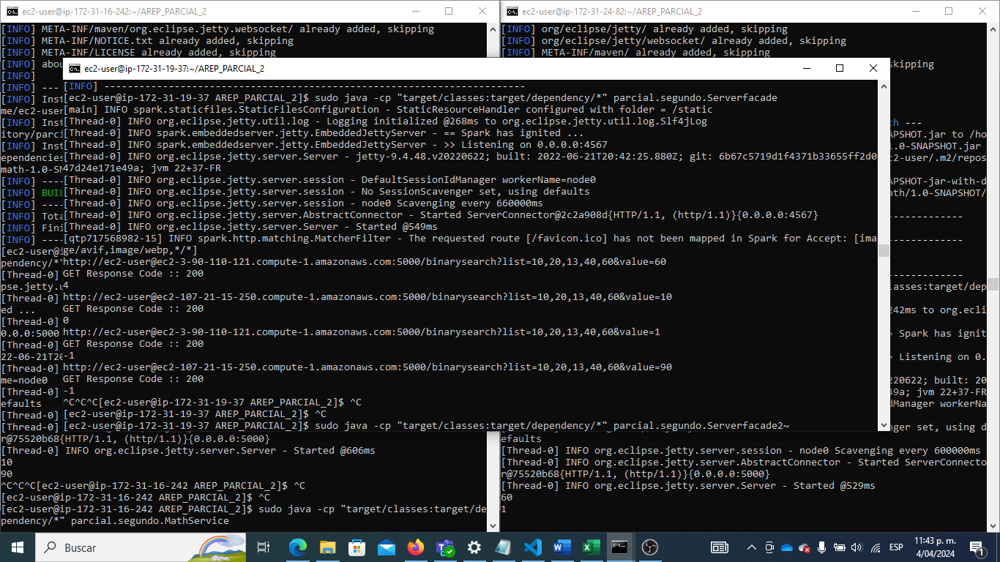

# Parcial final

## Descripción de la aplicación 
En este parcial realizamos la implementación de tres servidores, los cuales servían en conjunto para la localización de un número en una lista usando métodos de búsqueda binaria y lineal.

La arquitectura constaba de un servidor que servía como proxy, el cual, redirigía la búsqueda a los dos servidores que tenían las lógicas de búsqueda implementadas.


### Requisitos 

- [Git](https://git-scm.com/) - Control de versiones
- [Maven](https://maven.apache.org/) - Gestor de dependencias
- [Java](https://www.oracle.com/java/technologies/downloads/#java17) - Lenguaje de programación


## Ejecutando la aplicación 

Para poder ejecutar el program primero descarguelo del repositorio.

```bash
git clone https://github.com/cattus09/AREP_PARCIAL_2.git
cd AREP_PARCIAL_2
```

Para ejecutar la aplicación, ejecute el siguiente comando.

```bash
mvn clean install
```
```bash
sudo java -cp "target/classes:target/dependency/*" parcial.segundo.MathService

sudo java -cp "target/classes:target/dependency/*" parcial.segundo.Serverfacade
```

El anterior comando limpiará las contrucciones previas, compilará y luego ejecutará en distintos contenedores los servicios de la aplicación.

En su navegador entre a: [http://localhost:4567](http://localhost:4567) para ver la aplicación en funcionamiento.


## Ejecucion AWS


**Crear 3 maquinas en AWS:**


**Habilitar los  puerto**
- 22
- 4567
- 80
- 5000



**Conectar con las maquinas virtuales**




**instalar los progamas necesario**
correr los comandos 
- sudo yum install java
- sudo yum install git
- sudo yum install maven

**instalar los progamas necesario**
Para ejecutar la aplicación, ejecute el siguiente comando.


```bash
mvn clean install
```
para los dos servidores con el back
```bash
sudo java -cp "target/classes:target/dependency/*" parcial.segundo.MathService
```

para el proxi
```bash
sudo java -cp "target/classes:target/dependency/*" parcial.segundo.Serverfacade
```

En su nabegador entre a la maquina que uso como proxy con el puerto 4567 y empiece a usarla 

# video
https://youtu.be/4u65M38rjsw